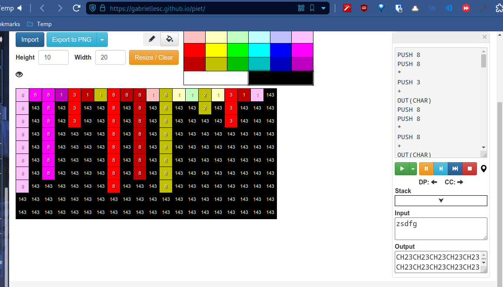
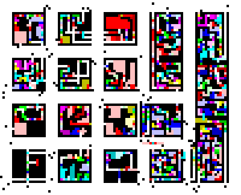

# PIET

* **Category:** (Medium)/(Hard)
* **Mode:** (Online)
* **Authors:**
  * Saharsh
* **Points:** TBD

## Specifications

* **Entry point:** `Image`
* **Reward:** Points

## Description

"Pixels Interestingly Express Thoughts, what do you think about them?? Say the magic words 3 times to unlock the treasure trove of points!!"

## Solution

1. Figure out that it is an esolang
2. Find out that it is piet
3. use a piet compiler to compile and run the image
4. https://gabriellesc.github.io/piet/
5. answer: `CH23CH23CH23`

https://gabriellesc.github.io/piet/

https://imgur.com/a/YGKZWSF

https://i.imgur.com/tOUppeI.png

## Hints:

https://imgur.com/a/04dXkF2

https://i.imgur.com/ExXJ1D1.png

- Link to divided image = cost: 25
